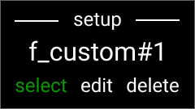
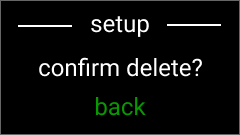

<!-- Auto-converted from DOCX to Markdown with figure filenames -->

MIDI CONTROLLER SYSTEM - OVERVIEW:

This system is a sophisticated hybrid analogue/digital MIDI controller, integrated into a custom electric guitar body, and designed for performance control of external effect units and plugins. Built around an Adafruit Feather ESP-32 v2, it combines traditional analogue potentiometers with digital switching, encoder navigation and display feedback for total control in a compact footprint.

The system primarily runs in two modes, one called “Setup” that consists of a series of menu items allowing the user to configure the system, and the other called “Play” that the user interacts with while playing the guitar. The user switches between these modes with a long press of the ‘mirror’ button.

The font used throughout the system is OpenSans_Semibold.

The only parts of the display screens that get redrawn must only ever be the pixels that actually change in operation. This is essential to minimise screen flicker.

RULES THAT MUST BE FOLLOWED BY CHATGPT:

Always refer to this live Google Doc spec (https://docs.google.com/document/d/1SFgdBO_iSVyG7hlJXhSwEFDKS-ioGw0zzdrPuDCGueo/edit) as the single source of truth for pin mappings, wiring, menu text, and behavior.

Keep responses concise and focused, tackling one topic at a time.

remember this: ALWAYS always consult, use and check the Adafruit ESP32 Feather V2 API for

After any code change, insist we test it on the Feather before moving on to the next tweak.

Only make the exact change I ask for, and nothing more.

Never overwrite or remove existing, working code unless explicitly told to.

Preserve all confirmed pin mappings and setup calls-no pin changes or SPI/init tweaks unless asked.

Use the minimal diff approach: change only the lines or logic specified, leave everything else intact.

Ensure display updates happen exactly where and when requested

Ask for clarification if a requested change is ambiguous, rather than guessing.

Always be 100% certain before asserting-if not absolutely sure, say so rather than guess.

Refer back to elements I’ve already approved (pin assignments, divider values, function names) rather than re-introducing old defaults

Preserve all existing positions, fonts, sizes, and other layout details unless I explicitly request adjustments.

Whenever I need tunable values (positions, sizes, colors), expose them as #define constants at the top so I can tweak them easily.

For real-time displays, draw static elements once in setup(), then update only the changing regions in loop() to avoid flicker and text artifacts

Don’t reorganize or refactor code unless it’s directly called for-keep all code as “lean” as possible around my requested features

HARDWARE OVERVIEW:

| Component | Description |
| --- | --- |
| Adafruit Feather ESP-32 v2 | Core microcontroller. Sends MIDI over DIN and BLE. |
| 4 Slide Potentiometers w/ LEDs Bourns PTL30-15G1-103B1 | Faders send MIDI CC when moved. LEDs are always ON, adjustable brightness via Setup menu. Also bring up relevant status display. |
| 4 Momentary Stomp Switches
RVFM JR5404 | Send MIDI CC (toggle or momentary). Also bring up relevant status display. |
| 1 Momentary ON-OFF-ON Toggle Switch
T8014A-SEBQ-H | Used to increment or decrement preset number, navigate menus and switch input modes |
| Rotary Encoder w/ Pushbutton Bourns PEC11R-4115K-S0018 | Navigates menus and selects presets. Pushbutton confirms actions. |
| 1 Additional Momentary Button (‘mirror’ button)
RVFM JR5404 | Used to send all fader CCs at once on a short press, or to enter/exit Setup or Play modes on a long press. |
| Adafruit 1.14" 240×135 TFT (ST7789) | Shows system state, preset selection, fader values, etc. |
| MIDI Din | Outputs MIDI data for a wired connection to external hardware |
| Power slide switch | Turns the system ON and OFF - connected to the Feather’s ENable pin |

FEATHER PIN CONNECTIONS:

| Function | ESP32 GPIO | Silkscreen | Routing Layer | Placement Advice | Connection Rules |
| --- | --- | --- | --- | --- | --- |
| TFT SCK (SPI CLK) | 5 | SCK | Top | Matched impedance; pair with MOSI | Keep short; bypass cap 100nF at display (already on the display board) |
| TFT MOSI (SPI Data) | 19 | MO | Top | Matched impedance; pair with SCK | Keep short; decoupling cap 100nF at display) add 100uf between 3.3v and ground on the shield close to the pins |
| TFT\_CS (Chip Select) | 14 | D14 | Top | Next to TFT\_DC | Digital output; pull high when inactive |
| TFT\_DC (Data/Command) | 15 | D15 | Top | Next to TFT\_CS | Digital output; select data/command |
| MIDI OUT TX | 8 | TX | Top | Keep away from analog | TX pin -to- 220Ω inline resistor -→ - DIN pin 5 -→ - 3.3v.DIN pin 4 = GNDDIN pin 2 = not connectedDOUBLE CHECK ONLINE! |
| Encoder A (A) | 7 | RX | Top | Close to encoder | Use code for internal pullup - pinmode (7, INPUT\_PULLUP);add series resistor: ENCA -→ - 220Ω resistor -→ - pin 7optional 0.1µF filter after the resistor to ground for encoder smoothing and emi/rfi rejection. Not fitting it = better edge-speed response |
| Encoder B (B) | 33 | D33 | Top | Close to encoder | As above except pin 33 |
| MUX Control A | 27 ADC2 | D27 | Top | Group with MUX lines | 220Ω series between mux a/b/c and pin;100nF bypass ceramic cap between mux vcc and 3.3v |
| MUX Control B | 22 | SDA | Top | Group with MUX lines | As above, only one bypass on vcc line as above |
| MUX Control C | 21 MISO | MI | Top | Group with MUX lines | As above, only one bypass on vcc line as above |
| MUX COM | 4 (was 37) | A5 (was D37) | Bottom | Isolate from digital | 1kΩ + 100nF RC filter \* see note below / over |
| TFT Brightness (PWM) | 13 | D13 | Top | Isolate from analog, connect to LIT on TFT | PWM; optional 10kΩ+100nF LPF |
| Fader 1 | 34 | A2 | Bottom | Group analog inputs | 1kΩ + 10nF RC; shielded cable |
| Fader 2 | 39 | A3 | Bottom | Group analog inputs | 1kΩ + 10nF RC; shielded cable |
| Fader 3 | 36 | A4 | Bottom | Group analog inputs | 1kΩ + 10nF RC; shielded cable |
| Fader 4 | 32 | D32 | Bottom | Group analog inputs | 1kΩ + 10nF RC; shielded cable |
| Fader LEDs | - | - | Top | Close to faders | 3.3V → 1kΩ → LED → GND |
| LED Brightness (PWM) | 12 | D12 | Top | Isolate from analog | PWM; optional 100Ω+LPF |
| Battery Voltage (VBAT) | 35 | A7 | - | INTERNAL PIN | Onboard divider; analogReadMilliVolts() |
| Power Switch | - | EN | - | Control enable | Switch between pin and ground |
| 3.3V Power | - | 3V | both layers | Power plane | Traces can be on both layers |
| Ground | - | GND | Both layers | Ground plane | Two ground pours top=digital, bottom-analogue.Use a cluster of small vias to tie the two pours together close to the ESP-32 GND pin, and connect it to that pin. |

MUX PIN CONNECTIONS:

| Function | Connected to | Mux Pin No | Channel |
| --- | --- | --- | --- |
| Preset Toggle Up | TGUP | MUX2 | CH7 |
| Preset Toggle Down | TGDN | MUX4 | CH6 |
| Stomp Switch 1 | SW1 | MUX15 | CH2 |
| Stomp Switch 2 | SW2 | MUX12 | CH3 |
| Stomp Switch 3 | SW3 | MUX1 | CH4 |
| Stomp Switch 4 | SW4 | MUX5 | CH5 |
| Encoder Switch | ENTER | MUX13 | CH0 |
| MIRROR Button (MUX14 CH1) | EDIT | MUX14 | CH1 |
| 3V (MUX16) | 3V | MUX16 |  |
| Ground (MUX6) | GND | MUX6 |  |
| Ground (MUX7) | GND | MUX7 |  |
| Ground (MUX8) | GND | MUX8 |  |
| MUX Control A (MUX11) | MUXA | MUX11 |  |
| MUX Control B (MUX10) | MUXB | MUX10 |  |
| MUX Control C (MUX9) | MUXC | MUX9 |  |
| MUX Common (MUX3) | MUXCOM | MUX3 |  |

* MCU MUXCOM / FADERS

│

R1 (1 kΩ)

│

┌────────┴─────────┐

│                  │

C1 (100 nF)        │

│                  │

GND              ──► MUX COM

For the fader, try 10nF first, increase up to 100uF

Use This Digital Mux Scan Pattern in All Future Code

Use digitalRead(MUXCOM) (37) for the mux common / signal pin.

Use MUXA =27, MUXB = 22, MUXC = 21 for the select lines.

Use the selectMuxChannel() function

Add minimal delay or debounce logic as needed for the real buttons.

SETUP MODE

SETUP MODE GENERAL NOTES:

All display screens in Setup mode have the centred header_text called ‘setup’ in OpenSans_SemiBold14pt, with horizontal lines either side

All display screens have either 3 or 4 rows of information.

All display screens in Setup mode have white filled triangles in fixed positions either side of text on the lower rows, to indicate there are either more menu items to select from on that row, or that that row can be modified by the user.

Navigate the menus by turning the encoder or using the toggle switch, then press the encoder button to confirm selections

No MIDI data is sent during ‘SETUP’ mode (unless MIDI channel or fader and stomp CC number selections need to be - confirm this during coding!)

SETUP MODE - UI FLOW LIST SHOWN IN ORDER OF MENU ITEMS (menu items are ‘round robin’):

setup_battery

setup_led

setup_led_brightness

setup_tft

setup_tft_brightness

setup_mode

setup_mode_select

setup_mirror

setup_mirror_select

setup_midi_ch

setup_midi_ch_select

setup_fader_labels

setup_fader_labels_select

setup_fader_labels_confirmation

setup_fader_labels_custom

setup_fader_labels_edit

setup_fader_labels_delete

setup_stomp_labels

setup_stomp_labels_select

setup_stomp_labels_confirmation

setup_stomp_labels_custom

setup_stomp_labels_edit

setup_stomp_labels_delete

setup_fader_cc

setup_fader_cc_select

setup_fader_cc_confirmation

setup_stomp_cc

setup_stomp_cc_select

setup_stomp_cc_confirmation

setup_stomp_type

setup_stomp_type_select

setup_stomp_type_confirmation

SETUP MODE - UI FLOW DETAILS:

setup_battery

Default display screen shown after a long press of the ‘mirror’ button in ‘Play’ mode

Uses the Use ESP32's built-in milliVolt reading for accuracy - analogReadMilliVolts - to display current battery level

header_text = ‘setup’ with horizontal lines either side

Next row shows a battery level bar divided into 5 equally spaced sections with a value number (range 0-100) in OpenSans_SemiBold14pt to the left of the bar. The bar display battery level from 0-100% from right to left, 100% full all the way to the left, 0% empty fill to the right. The far-right section gets filled in red, then moving left the second section gets filled with orange (0xFD20), then the 3 remaining sections to the left get filled with green. The bar outline and dividing lines are all drawn last so they stay on top. Only ever redraw pixels that change. The value number shows the current battery level.

The bottom row shows menu_item = ‘battery level’ in OpenSans_SemiBold14pt, centred on the screen, with a white filled triangle either side

Encoder turn or toggle switch moves to the next setup menu item

long press on the mirror button returns into ‘PLAY’ mode from ‘SETUP’ mode:

setup_led

header_text = ‘setup’ with horizontal lines either side

Next row shows bar divided into 4 equally spaced sections with a value number (range 0-20) in OpenSans_SemiBold14pt to the left of the bar. The bar displays current LED brightness from 0-20 from right to left, 100% brightness all the way to the left, 0% (off) to the right. The bar gets filled with green. The bar outline and dividing lines are all drawn last so they stay on top. Only ever redraw pixels that change. The value number shows the current brightness value.

The bottom row shows menu_item = ‘LED level’ in OpenSans_SemiBold14pt, centred on the screen, with a white filled triangle either side

Encoder button press displays setup_led_brightness screen

Encoder turn or toggle switch moves to the next setup menu item

long press on the mirror button returns into ‘PLAY’ mode from ‘SETUP’ mode:

setup_led_brightness

header_text = ‘setup’ with horizontal lines either side

Next row shows a bar divided into 4 equally spaced sections with a white filled triangle either side. The bar displays current LED brightness from 0-20 from right to left, 100% brightness all the way to the left, 0% (off) to the right. The bar gets filled with red. The bar outline and dividing lines are all drawn last so they stay on top. Only ever redraw pixels that change.

The bottom row shows the text ‘LED level’ and a value number (range 0-20) in OpenSans_SemiBold14pt to the right of the text. The value number shows the current LED brightness value. Only ever redraw pixels that change.

Encoder turn or toggle switch uses PWM on pin D12 to set all 4 fader potentiometer LED brightness level on a logarithmic scale from 0 (off) to 20 (100%), so there is a smooth visual increase in brightness at each step

Encoder button press confirms the brightness selection and saves it to memory (EEPROM) as the ‘LED_brightness_value’ then displays setup_led screen (paragraph 2) again

setup_tft

header_text = ‘setup’ with horizontal lines either side

Next row shows bar divided into 4 equally spaced sections with a value number (range 0-20) in OpenSans_SemiBold14pt to the left of the bar. The bar displays current TFT brightness from 0-20 from right to left, 100% brightness all the way to the left, 0% (off) to the right. The bar gets filled with green. The bar outline and dividing lines are all drawn last so they stay on top. Only ever redraw pixels that change. The value number shows the current TFT brightness value.

The bottom row shows menu_item = ‘brightness’ in OpenSans_SemiBold14pt, centred on the screen, with a white filled triangle either side

Encoder button press displays setup_tft_brightness screen (paragraph 3.2)

Encoder turn or toggle switch moves to the next setup menu item

long press on the mirror button returns into ‘PLAY’ mode from ‘SETUP’ mode:

setup_tft_brightness

header_text = ‘setup’ with horizontal lines either side

Next row shows a bar divided into 4 equally spaced sections with a white filled triangle either side. The bar displays current TFT brightness from 0-20 from right to left, 100% brightness all the way to the left, 0% (off) to the right. The bar gets filled with red. The bar outline and dividing lines are all drawn last so they stay on top. Only ever redraw pixels that change.

The bottom row shows menu_item = ‘brightness’ and a value number (range 0-20) in OpenSans_SemiBold14pt to the right of the text. The value number shows the current TFT brightness value. Only ever redraw pixels that change.

Encoder turn or toggle switch uses PWM on pin D13 to set the TFT display backlight brightness level on a logarithmic scale from 0 (off) to 20 (100%), so there is a smooth visual increase in brightness at each step

Encoder button press confirms the brightness selection and saves it to memory (EEPROM) as the ‘TFT_brightness_value’ then displays setup_tft screen (paragraph 3) again

setup_mode

header_text = ‘setup’ with horizontal lines either side

Next row shows the current_mode in use in OpenSans_SemiBold14pt in green.

The bottom row shows menu_item = ‘preset mode’ in OpenSans_SemiBold14pt, centred on the screen, with a white filled triangle either side

Encoder button press displays setup_mode_select screen

Encoder turn or toggle switch moves to the next setup menu item

long press on the mirror button returns into ‘PLAY’ mode from ‘SETUP’ mode:

setup_mode_select

header_text = ‘setup’ with horizontal lines either side

the next row shows the next_mode in OpenSans_SemiBold14pt in red, with a filled white triangle either side.

The bottom row shows the centred text ‘select preset mode’ in OpenSans_SemiBold14pt.

Encoder turn or toggle switch selects from a list of preset modes called ‘preset_mode_list’. These mode functions are listed in table 12 (SYSTEM STATE / EEPROM STORAGE / LOOKUP TABLES) and described in detail in section 13 of this document

Encoder button press confirms the mode selection and saves it to memory (EEPROM) then displays the setup_mode screen (paragraph 4) again

Upon selection of a preset mode, the system must immediately initialize all Fader and Stomp CC assignments to the values shown below. These defaults apply only on first entry into a mode; users may then adjust any assignment via the Setup → CC Assignment screens. For modes that do not support on‑device MIDI Learn (Kemper, Axe‑FX), the system also provides default labels matching each CC parameter (max 10 characters).

| Mode | Control | CC \# | Parameter Controlled | Default Label |
| --- | --- | --- | --- | --- |
| 0-127 | Fader 1 | 20 | User-defined (Full MIDI Learn) | - |
| 0-127 | Fader 2 | 21 | User-defined (Full MIDI Learn) | - |
| 0-127 | Fader 3 | 22 | User-defined (Full MIDI Learn) | - |
| 0-127 | Fader 4 | 23 | User-defined (Full MIDI Learn) | - |
| 0-127 | Stomp 1 | 80 | User-defined (Full MIDI Learn) | - |
| 0-127 | Stomp 2 | 81 | User-defined (Full MIDI Learn) | - |
| 0-127 | Stomp 3 | 82 | User-defined (Full MIDI Learn) | - |
| 0-127 | Stomp 4 | 83 | User-defined (Full MIDI Learn) | - |
|  |  |  |  |  |
| 1-128 | Fader 1 | 20 | User-defined (Full MIDI Learn) | - |
| 1-128 | Fader 2 | 21 | User-defined (Full MIDI Learn) | - |
| 1-128 | Fader 3 | 22 | User-defined (Full MIDI Learn) | - |
| 1-128 | Fader 4 | 23 | User-defined (Full MIDI Learn) | - |
| 1-128 | Stomp 1 | 80 | User-defined (Full MIDI Learn) | - |
| 1-128 | Stomp 2 | 81 | User-defined (Full MIDI Learn) | - |
| 1-128 | Stomp 3 | 82 | User-defined (Full MIDI Learn) | - |
| 1-128 | Stomp 4 | 83 | User-defined (Full MIDI Learn) | - |
|  |  |  |  |  |
| Kemper | Fader 1 | 72 | Amplifier Gain | Amp Gain |
| Kemper | Fader 2 | 4 | Pitch Pedal | Pitch |
| Kemper | Fader 3 | 69 | Delay Feedback | Delay Fdbk |
| Kemper | Fader 4 | 71 | Reverb Time | ReverbTime |
| Kemper | Stomp 1 | 17 | Pre-amp Effect Block A | Effect A |
| Kemper | Stomp 2 | 18 | Pre-amp Effect Block B | Effect B |
| Kemper | Stomp 3 | 22 | Post-amp FX Slot X | FX Slot X |
| Kemper | Stomp 4 | 24 | Post-amp Modulation Slot | Mod Slot |
|  |  |  |  |  |
| Axe-FX | Fader 1 | 20 | Manual - no fixed parameter | CC20 |
| Axe-FX | Fader 2 | 21 | Manual - no fixed parameter | CC21 |
| Axe-FX | Fader 3 | 22 | Manual - no fixed parameter | CC22 |
| Axe-FX | Fader 4 | 23 | Manual - no fixed parameter | CC23 |
| Axe-FX | Stomp 1 | 80 | Manual - no fixed parameter | CC80 |
| Axe-FX | Stomp 2 | 81 | Manual - no fixed parameter | CC81 |
| Axe-FX | Stomp 3 | 82 | Manual - no fixed parameter | CC82 |
| Axe-FX | Stomp 4 | 83 | Manual - no fixed parameter | CC83 |

Updated Setup UI Flow

Setup → Mode

User selects a new Preset Mode.

On Mode Selection

Load the factory CC defaults and, for non-MIDI-Learn modes, populate each label field (ensuring labels do not exceed 10 characters).

Reflect in UI

In Setup → CC Assignment, each entry shows its new default value and default label where applicable.

Persistence

Save both CC values and labels to EEPROM so defaults persist until the user overrides them.

Edge Cases

Re-selecting the same mode does not reload defaults or labels.

setup_mirror

header_text = ‘setup’ with horizontal lines either side

Next row shows the current_m_delay value in OpenSans_SemiBold14pt (to be confirmed during testing) in green.

The bottom row shows menu_item = ‘mirror delay’ in OpenSans_SemiBold14pt, centred on the screen, with a white filled triangle either side

Encoder button press displays setup_mirror_select screen

Encoder turn or toggle switch moves to the next setup menu item

long press on the mirror button returns into ‘PLAY’ mode from ‘SETUP’ mode:

setup_mirror_select

header_text = ‘setup’ with horizontal lines either side

the next row shows the next_m_delay in seconds using OpenSans_SemiBold14pt (to be confirmed during testing) in red, with a filled white triangle either side.

The bottom row shows the centred text ‘select mirror delay’ in OpenSans_SemiBold14pt.

Encoder turn or toggle switch adjusts the delay time value for m_delay (range 0 (OFF) - 3.0 seconds) and displays it on the screen in seconds to one decimal place, eg ‘1.2 sec’

m_delay is a value that sets how long the delay time is to the nearest 1/10th of a second between short pressing the mirror button and midi data being sent to update all the current fader potentiometer positions

Encoder button press confirms the mirror delay time and saves it to memory (EEPROM) as the ‘mirror_delay_value’ then displays the setup_mirror screen (paragraph 5) again

setup_MIDI_CH

header_text = ‘setup’ with horizontal lines either side

the next row shows ‘BLE’ on the left and ‘DIN’ on the right in OpenSans_SemiBold14pt (to be confirmed during testing) in white

the next row shows the current_BLE_MIDI_CH value for BLE on the left and current_DIN_MIDI_CH value for DIN on the right in OpenSans_SemiBold14pt (to be confirmed during testing) in white

The bottom row shows the centred text ‘MIDI channel’ in OpenSans_SemiBold14pt with a filled white triangle either side.

Encoder button press displays setup_MIDI_CH_select screen (paragraph 6.2)

Encoder turn or toggle switch moves to the next setup menu item

long press on the mirror button returns into ‘PLAY’ mode from ‘SETUP’ mode

setup_MIDI_CH_select

header_text = ‘setup’ with horizontal lines either side

the next row shows ‘BLE’ on the left and ‘DIN’ on the right in OpenSans_SemiBold14pt (to be confirmed during testing) in white

the next row shows the current_BLE_MIDI_CH value for BLE on the left selected and in green and current_DIN_MIDI_CH value for DIN on the right in white in OpenSans_SemiBold14pt (to be confirmed during testing)

The bottom row shows the centred text ‘select OUTPUT’ in OpenSans_SemiBold14pt with a filled white triangle either side.

Encoder turn or toggle switch scrolls through the two MIDI channel number values on the display by turning each on green in turn, while the other stays white

Encoder button press confirms which midi output to change the MIDI channel value for and displays the setup_MIDI_CH_confirmation screen (paragraph 6.3)

setup_MIDI_CH_confirmation

header_text = ‘setup’ with horizontal lines either side

Next row shows the current_BLE/DIN_CC in use in OpenSans_SemiBold14pt (to be confirmed during testing) in red, with a white filled triangle either side

The bottom row shows menu_item = ‘select BLE/DIN MIDI CH’ in OpenSans_SemiBold14pt, centred on the screen

Encoder turn or toggle switch scrolls through the next_BLE/DIN_MIDI_CH value, a round robin number range between 00 and 127, listed as 00, 01,02...21,22,23...126,127.

Encoder button press confirms the BLE/DIN MIDI channel selection for that output and saves it to memory (EEPROM) as either the ble_midi_ch_value or the din_midi_ch_value, and displays the setup_MIDI_CH screen (paragraph 6) again

setup_fader_labels

header_text = ‘setup’ with horizontal lines either side

the next row shows F1 F2 F3 F4 in a row using OpenSans_SemiBold14pt (to be confirmed during testing) in white

The bottom row shows menu_item = ‘FADER labels’ in OpenSans_SemiBold14pt, centred on the screen, with a white filled triangle either side

Encoder button press displays setup_fader_labels_select screen (paragraph 7.2)

Encoder turn or toggle switch moves to the next setup menu item

long press on the mirror button returns into ‘PLAY’ mode from ‘SETUP’ mode

setup_fader_labels_select

header_text = ‘setup’ with horizontal lines either side

the next row shows F1 F2 F3 F4 in a row using OpenSans_SemiBold14pt (to be confirmed during testing) in white, apart from the currently selected fader number which is in green text

The bottom row shows menu_item = ‘FADER labels’ in OpenSans_SemiBold14pt, centred on the screen, with a white filled triangle either side

Encoder turn or toggle switch scrolls through the four round robin fader number values on the display by turning each on green in turn, while the rest stay white

Encoder button press confirms the fader number to change the label for and displays the Setup_FADER_labels_list screen (paragraph 7.3)

long press on the mirror button returns into ‘PLAY’ mode from ‘SETUP’ mode

setup_FADER_labels_list

header_text = ‘setup’ with horizontal lines either side

Next row shows the current ‘F1/2/3/4_label_value’ in OpenSans_SemiBold14pt (to be confirmed during testing), with a white filled triangle either side, starting with the currently active value in green. All other values in the list are to be displayed in white when called for by the encoder or toggle switch, which turn to green if selected by an encoder switch press

The default ‘F1_label_value’ to be active and shown in green for F1 is ‘distortion’

The default ‘F2_label_value’ to be active and shown in green for F2 is ‘modulation’

The default ‘F3_label_value’ to be active and shown in green for F3 is ‘delay’

The default ‘F4_label_value’ to be active and shown in green for F4 is ‘reverb’

See section 15 for details of the ‘fader_labels_list’

The bottom row shows menu_item = ‘select (F1 / F2 / F3 / F4) label’ in OpenSans_SemiBold14pt, centred on the screen

Encoder turn or toggle switch moves to the next value in the ‘fader_labels_list’, displayed in white except the currently selected value which is displayed in green

Encoder button press makes the currently displayed ‘fader_labels_list’ item turn green, and makes it active by saving it to the ‘F1/F2/F3/F4_label_value’ memory. After a 1500ms delay the display returns to the setup_fader_labels screen (paragraph 7) UNLESS the ‘CUSTOM’ value is chosen from the ‘fader_labels_list’, in which case display the Setup_FADER_labels_custom screen (paragraph 7.4)

Setup_FADER_labels_custom

header_text = ‘setup’ with horizontal lines either side

the next row shows a flashing white rectangle the size of the largest capital letter followed by a row of 9 hyphens using OpenSans_SemiBold14pt (to be confirmed during testing) in red, with a filled white triangle either side.

The flashing rectangle and each hyphen are placeholders for the user to choose a letter in turn to spell out a custom label to add to the ‘custom_fader_labels_list’. The flashing rectangle is a cursor showing which character position is going to be edited.

The bottom row shows the centred text ‘custom (F1 / F2 / F3 / F4) label’ in OpenSans_SemiBold14pt, centred on the screen

Encoder turn scrolls through a round robin lower case then upper case then number 0-9 list of characters in the position where the flashing cursor rectangle was

Encoder button press confirms the current character selected in the first position, saves it to memory (EEPROM) building a custom label in the ‘custom_fader_labels_list’ and keeps it displayed on the screen, then moves the cursor to the next hyphen position for the user to select a character in the same way.

The toggle switch moves the cursor left or right along the character row at any stage

Every press of the encoder then confirms the current character selected in the next position, saves it to memory (EEPROM) and displays it on the screen, then moves the cursor to the next hyphen position for the user to select a character in the same way.

No more than 10 character positions can be filled

if the mirror button is short pressed, the full name is stored in memory (EEPROM) and added to the ‘custom_fader_labels_list’ as a custom_label with a suffix number (starting at 01), and the display returns to the setup_FADER_labels_list screen (paragraph 7.3) with the new custom label made active by saving it to the ‘F1/F2/F3/F4_label_value’ memory and displaying it in green.

Setup_FADER_labels_edit

If an existing user created custom label is selected on the Setup_FADER_labels_list screen, display the Setup_FADER_labels_edit screen:

header_text = ‘setup’ with horizontal lines either side

Next row shows the current ‘custom_fader_labels_list’ value in OpenSans_SemiBold14pt (to be confirmed during testing), in white.

The bottom row shows three options - ‘select’, ‘edit’ and ‘delete’ in OpenSans_SemiBold14pt. ‘select’ is in green and is the currently selected option, the other two in white.

Encoder turn or toggle switch scrolls through the three round robin options on the display by turning each on green in turn, while the rest stay white

Encoder button press confirms the option selected by displaying the relevant screen:

If encoder button is pressed on ‘select’, make the current ‘custom_fader_labels_list’ value active for the fader being labelled and return to the Setup_FADER_labels_select screen (paragraph 7.2)

If encoder button is pressed on ‘edit’ return to the Setup_FADER_labels_custom screen (paragraph 7.4), with the current label already in the character spaces but editable

If encoder button is pressed on ‘delete’ go to the Setup_FADER_labels_delete (paragraph 7.6) screen

Setup_FADER_labels_delete

header_text = ‘setup’ with horizontal lines either side

Next row shows ‘confirm delete?’ in OpenSans_SemiBold14pt (to be confirmed during testing), in white.

The bottom row shows ‘back’ in OpenSans_SemiBold14pt in green, which is the currently selected option.

Encoder turn or toggle switch scrolls between the two round robin options on the display by turning each on green in turn, while the other stays white

Encoder button press confirms the green option selected by displaying the relevant screen:

If encoder button is pressed on ‘back’ return to the Setup_FADER_labels_edit (paragraph 7.5)

If encoder button is pressed on ‘confirm delete?’, remove that custom label from the custom_fader_labels_list list and return to the Setup_FADER_labels_list screen (paragraph 7.3), with the ‘custom’ label active in green

setup_stomp_labels

Exactly the same as setup_fader_labels (paragraph 7) except:

F1, F2, F3 and F4 become S1, S2, S3 and S4

‘FADER labels’ becomes ‘STOMP labels’

setup_stomp_labels_select

Exactly the same as setup_fader_labels_select (paragraph 7.2) except:

F1, F2, F3 and F4 become S1, S2, S3 and S4

‘select FADER’ becomes ‘select STOMP’

setup_STOMP_labels_list

Exactly the same as setup_FADER_labels_list (paragraph 7.3) except:

’f_labels_list’ becomes ’s_labels_list’ and uses ‘stomp_labels_list’ instead of ‘fader_labels_list’

‘select F1, F2, F3, F4 label’ becomes ‘select S1, S2, S3, S4 label’

Setup_STOMP_labels_custom

Exactly the same as Setup_FADER_labels_custom (paragraph 7.4) except:

‘custom F1, F2, F3, F4 label’ becomes ‘custom S1, S2, S3, S4 label’ and uses ‘custom_stomp_labels_list’ instead of ‘custom_fader_labels_list’

Setup_STOMP_labels_edit

If an existing user created custom label is selected on the Setup_STOMP_labels_list screen, display the Setup_STOMP_labels_edit screen:

Exactly the same as Setup_FADER_labels_edit (paragraph 7.5) except:

the current ‘custom_fader_labels_list’ value becomes the current ‘custom_stomp_labels_list’ value

Encoder button press confirms the option selected by displaying the relevant screen:

If encoder button is pressed on ‘select’, make the current custom_stomp_labels_list value active for the stomp being labelled and return to the Setup_STOMP_labels_select screen (paragraph 8.2)

If encoder button is pressed on ‘edit’ return to the Setup_STOMP_labels_custom screen (paragraph 8.4), with the current label already in the character spaces but editable

If encoder button is pressed on ‘delete’ go to the Setup_STOMP_labels_delete (paragraph 8.6) screen

Setup_STOMP_labels_delete

Exactly the same as Setup_FADER_labels_delete (paragraph 7.6) except:

If encoder button is pressed on ‘back’ return to the Setup_STOMP_labels_edit (paragraph 8.5)

If encoder button is pressed on ‘confirm delete?’, remove that custom label from the s_custom label list and return to the Setup_STOMP_labels_list screen (paragraph 8.3), with the ‘custom’ label active in green

setup_fader_CC

header_text = ‘setup’ with horizontal lines either side

Next row shows F1 F2 F3 F4 in a row using OpenSans_SemiBold14pt (to be confirmed during testing) in white.

Next row shows current CC numbers assigned to each fader, values directly below F1 F2 F3 and F4 using OpenSans_SemiBold14pt (to be confirmed during testing) in white.

The bottom row shows menu_item = ‘FADER CC in OpenSans_SemiBold14pt, centred on the screen, with a white filled triangle either side

Encoder button press displays Setup_FADER_CC_select screen (paragraph 9.2)

Encoder turn or toggle switch moves to the next setup menu item

long press on the mirror button returns into ‘PLAY’ mode from ‘SETUP’ mode

setup_fader_CC_select

header_text = ‘setup’ with horizontal lines either side

the next row shows F1 F2 F3 F4 in a row using OpenSans_SemiBold14pt (to be confirmed during testing) in white

Next row shows current CC numbers assigned to each fader, with values directly below F1 F2 F3 and F4 using OpenSans_SemiBold14pt (to be confirmed during testing) in white, apart from the first value below F1 which is currently selected and in green

Default fader CC numbers are:

F1 - 20

F2 - 21

F3 - 22

F4 - 23

The bottom row shows menu_item = ‘select FADER’ in OpenSans_SemiBold14pt, centred on the screen, with a white filled triangle either side

Encoder turn or toggle switch scrolls through the four CC number values on the display by turning each on green in turn, while the rest stay white

Encoder button press confirms the fader CC number to change the label for and displays the setup_FADER_CC_confirmation screen (paragraph 9.3)

Setup_FADER_CC_confirmation

Figure 9.3  - setup_FADER_CC_confirmation screen

header_text = ‘setup’ with horizontal lines either side

Next row shows the current_FADER_CC in use in OpenSans_SemiBold14pt (to be confirmed during testing) in red, with a white filled triangle either side

The bottom row shows menu_item = ‘select FADER 1/2/3/4 CC’ in OpenSans_SemiBold14pt, centred on the screen

Encoder turn or toggle switch scrolls through the next_FADER_CC value, a round robin number range between 00 and 127, listed as 00, 01,02...21,22,23...126,127.

Encoder button press confirms the MIDI CC selection for that fader and saves it to memory (EEPROM), and displays the setup_fader_CC screen (paragraph 9) again

setup_stomp_cc

header_text = ‘setup’ with horizontal lines either side

Next row shows S1 S2 S3 S4 in a row using OpenSans_SemiBold14pt (to be confirmed during testing) in white.

Next row shows current CC numbers assigned to each stomp, values directly below S1 S2 S3 and S4 using OpenSans_SemiBold14pt (to be confirmed during testing) in white.

The bottom row shows menu_item = ‘STOMP CC’ in OpenSans_SemiBold14pt, centred on the screen, with a white filled triangle either side

Encoder button press displays Setup_STOMP_CC_select screen (paragraph 10.2)

Encoder turn or toggle switch moves to the next setup menu item

long press on the mirror button returns into ‘PLAY’ mode from ‘SETUP’ mode

setup_stomp_CC_select

header_text = ‘setup’ with horizontal lines either side

the next row shows S1 S2 S3 S4 in a row using OpenSans_SemiBold14pt (to be confirmed during testing) in white

Next row shows current CC numbers assigned to each stomp, with values directly below S1 S2 S3 and S4 using OpenSans_SemiBold14pt (to be confirmed during testing) in white, apart from the first value below S1 which is currently selected and in green

Default stomp CC numbers are:

S1 - 80

S2 - 81

S3 - 82

S4 - 83

The bottom row shows menu_item = ‘select STOMP in OpenSans_SemiBold14pt, centred on the screen, with a white filled triangle either side

Encoder turn or toggle switch scrolls through the four CC number values on the display by turning each on green in turn, while the rest stay white

Encoder button press confirms the stomp CC number to change the label for and displays the setup_STOMP_CC_confirmation screen (paragraph 10.3)

Setup_STOMP_CC_confirmation

header_text = ‘setup’ with horizontal lines either side

Next row shows the current_STOMP_CC in use in OpenSans_SemiBold14pt (to be confirmed during testing) in red, with a white filled triangle either side

The bottom row shows menu_item = ‘select STOMP 1/2/3/4 CC’ in OpenSans_SemiBold14pt, centred on the screen

Encoder turn or toggle switch scrolls through the next_STOMP_CC value, a round robin number range between 00 and 127, listed as 00, 01,02...21,22,23...126,127.

Encoder button press confirms the MIDI CC selection for that stomp and saves it to memory (EEPROM), and displays the setup_stomp_labels screen (paragraph 10) again

setup_stomp_type

header_text = ‘setup’ with horizontal lines either side

Next row shows S1 S2 S3 S4 in a row using OpenSans_SemiBold14pt (to be confirmed during testing) in white.

Next row shows current stomp switch type assigned to each stomp, values directly below S1 S2 S3 and S4 using OpenSans_SemiBold14pt (to be confirmed during testing) in white. Options are MO (momentary) and TG (toggle)

The bottom row shows menu_item = ‘STOMP type’ in OpenSans_SemiBold14pt, centred on the screen, with a white filled triangle either side

Encoder button press displays setup_STOMP_type_select screen (paragraph 11.2)

Encoder turn or toggle switch moves to the next setup menu item

long press on the mirror button returns into ‘PLAY’ mode from ‘SETUP’ mode

setup_stomp_type_select

header_text = ‘setup’ with horizontal lines either side

the next row shows S1 S2 S3 S4 in a row using OpenSans_SemiBold14pt (to be confirmed during testing) in white

Next row shows current stomp switch type assigned to each stomp, with values directly below S1 S2 S3 and S4 using OpenSans_SemiBold14pt (to be confirmed during testing) in white, apart from the first value below S1 which is currently selected and in green

Default stomp types are:

S1 - TG

S2 - TG

S3 - TG

S4 - TG

The bottom row shows menu_item = ‘select STOMP in OpenSans_SemiBold14pt, centred on the screen, with a white filled triangle either side

Encoder turn or toggle switch scrolls through the four switch type values on the display by turning each on green in turn, while the rest stay white

Encoder button press confirms the stomp number to change the type for and displays the setup_STOMP_type_confirmation screen (paragraph 11.3)

Setup_STOMP_type_confirmation

header_text = ‘setup’ with horizontal lines either side

Next row shows the current_STOMP_type in use in OpenSans_SemiBold14pt (to be confirmed during testing) in red, with a white filled triangle either side

setup_stomp_type_select OpenSans_SemiBold14pt, centred on the screen

Encoder turn or toggle switch scrolls through the next_STOMP_type value, a round robin choice of either ‘toggle’ (TG) or ‘momentary’ (MO)

Encoder button press confirms the switch type selection for that stomp and saves it to memory (EEPROM), changes the behaviour of that stomp to the selected type, and displays the setup_stomp_type screen (paragraph 11) again

SYSTEM STATE / EEPROM STORAGE / LOOKUP TABLES

| Type | NAME | PARAGRAPH | RANGE | NOTES |
| --- | --- | --- | --- | --- |
| LED brightness | LED\_brightness\_value | 2.2 | 0 (off) -20 (max) | Logarithmic scale, 0-100% brightness Default = 100% |
| TFT brightness | TFT\_brightness\_value | 3.2 | 0 (off) -20 (max) | Logarithmic scale, 0-100% brightness Default = 100% |
| Preset mode | preset\_mode\_list | 4.2.5, 4.2.6 | List - 0-127, 1-128, Axe-FX etc | See section 13 for details. See section 13.2 for the preset\_mode\_list contents Default = 001-127 |
| current preset | current\_preset\_value |  | Depends on preset mode selected | See preset handling in ‘PLAY’ mode section Default = 001 |
| ‘Mirror’ delay | mirror\_delay\_value | 5.25/5.26/5.27 | 0 - 3.0 seconds | Value in seconds to one decimal place Default = 0.5 seconds |
| BLE MIDI channel | ble\_midi\_ch\_value | 6.3.5 | 00-127 | Default = channel 01 |
| DIN MIDI channel | din\_midi\_ch\_value | 6.3.5 | 00-127 | Default = channel 01 |
| Fader labels | fader\_labels\_list | 7.3.3 | fader 1 fader 2 fader 3 fader 4 distortion gain drive fuzz modulation phaser flanger rotary tremolo wah ring mod delay delay time delay fbck reverb pitch \*custom\* | Default = fader 1 fader 2 fader 3 fader 4 |
| Custom fader labels | custom\_fader\_labels\_list | 7.4 | custom\_label\_01 custom\_label\_02 custom\_label\_03 etc | Custom list is created by the user |
| F1 label | F1\_label\_value | 7.3.13 | Selected label for F1 |  |
| F2 label | F2\_label\_value | 7.3.13 | Selected label for F2 |  |
| F3 label | F3\_label\_value | 7.3.13 | Selected label for F3 |  |
| F4 label | F4\_label\_value | 7.3.13 | Selected label for F4 |  |
| stomp labels | stomp\_labels\_list | 8.3.3 | stomp 1 stomp 2 stomp 3 stomp 4 distortion gain drive fuzz modulation phaser flanger rotary tremolo wah ring mod delay reverb kill \*custom\* | Default = stomp 1 stomp 2 stomp 3 stomp 4 |
| Custom stomp labels | custom\_stomp\_labels\_list | 8.4 | custom\_stomp\_label\_01 custom\_stomp\_label\_02 custom\_stomp\_label\_03 etc | Custom list is created by the user |
| S1 label | S1\_label\_value | 8.3 | Selected label for S1 |  |
| S2 label | S2\_label\_value | 8.3 | Selected label for S2 |  |
| S3 label | S3\_label\_value | 8.3 | Selected label for S3 |  |
| S4 label | S4\_label\_value | 8.3 | Selected label for S4 |  |
| Fader 1 CC | F1\_CC\_value | 9.3 | 0-127 |  |
| Fader 2 CC | F2\_CC\_value | 9.3 | 0-127 |  |
| Fader 3 CC | F3\_CC\_value | 9.3 | 0-127 |  |
| Fader 4 CC | F4\_CC\_value | 9.3 | 0-127 |  |
| Stomp 1 CC | S1\_CC\_value | 10.3 | 0-127 |  |
| Stomp 2 CC | S2\_CC\_value | 10.3 | 0-127 |  |
| Stomp 3 CC | S3\_CC\_value | 10.3 | 0-127 |  |
| Stomp 4 CC | S4\_CC\_value | 10.3 | 0-127 |  |
| Stomp 1 type | S1\_type\_value | 11.3 | TG or MO | Toggle or momentary |
| Stomp 2 type | S2\_type\_value | 11.3 | TG or MO | Toggle or momentary |
| Stomp 3 type | S3\_type\_value | 11.3 | TG or MO | Toggle or momentary |
| Stomp 4 type | S4\_type\_value | 11.3 | TG or MO | Toggle or momentary |
| Screen offset (x/y) | screen\_offset |  | Value (pixels) | Distance in pixels from top left corner (x/y) of screen Default = 5,5 |
| Device name | device\_name |  | Default is ‘deep\_control’ | Use default for now, add ability of user to change later |
|  |  |  |  |  |
|  |  |  |  |  |

EXTERNAL HARDWARE PRESET FORMATS / MODES:

General rules:

The controller will work differently depending upon the MODE selected in the SETUP menu

All preset numbers are ‘round robin’

All fader CC values are 0-127, scaled to 0.0 - 10 on the display

All stomps are CC value 0 for OFF and 127 for ON

preset_mode_list

0-127

1-128

Helix

Kemper

Axe-FX

Bias-FX

AmpliTube

JamUp

ToneStack

Loopy

0-127 PRESET HANDLING:

Program Change (PC) messages 0-127 change presets 0-127 on the external unit

The 0-127_DEFAULT screen 

shows title “- preset -“

shows the current PRESET number in large white font

on encoder turn [IMAGE OF PRESET

keeps title “- preset -“ replaces big number with two columns:

left column has “NOW” with the current preset number below (0-127)

right column has “NEXT” with the next preset number below (0-127), changing with the encoder turn

right column is RED colour

returns to 0-127_DEFAULT SCREEN after 5000ms delay if no interaction is detected

on encoder press

returns to the 0-127_DEFAULT screen with preset number updated

sends corresponding MIDI message

on short toggle switch push

keeps title “- preset -“ replaces big number with two columns:

left column has “NOW” with the current preset number below (0-127)

right column has “NEXT” with the next preset number below (0-127), changing with each toggle press either UP/DOWN (INC/DEC)

right column is RED colour

on long toggle switch push:

As short push, except after 1 second the NEXT number scrolls automatically once every 200ms until released

on toggle release

returns to the 0-127_DEFAULT screen with preset number updated

sends corresponding MIDI message

0-127 CC handling:

assume Full MIDI Learn, can send any CC number from your controller, and the system will learn it

USE THESE DEFAULTS ON FIRST SELECTING THE 0-127 MODE - user may change them via the SETUP menu:

FADER 1 - CC 20

FADER 2 - CC 21

FADER 3 - CC 22

FADER 4 - CC 23

STOMP 1 - CC 80

STOMP 2 - CC 81

STOMP 3 - CC 82

STOMP 4 - CC 83

1-128 PRESET HANDLING:

EXACTLY THE SAME AS 0-127 mode, except:

Program Change (PC) messages 0-127 change presets 1-128 on the external unit

The screen shows preset numbers 1-128 instead of 0-127

1-128 CC handling:

assume Full MIDI Learn, can send any CC number from your controller, and the system will learn it

USE THESE DEFAULTS ON FIRST SELECTING THE 1-128 MODE - user may change them via the SETUP menu:

FADER 1 - CC 20

FADER 2 - CC 21

FADER 3 - CC 22

FADER 4 - CC 23

STOMP 1 - CC 80

STOMP 2 - CC 81

STOMP 3 - CC 82

STOMP 4 - CC 83

HELIX PRESET HANDLING:

Program Change (PC) messages 0-127 change presets 1-128 on the external unit

The HELIX_DEFAULT screen 

shows title “- preset -“

shows the current PRESET number in large white font

on encoder turn [IMAGE OF PRESET

keeps title “- preset -“ replaces big number with two columns:

left column has “NOW” with the current preset number below (1-128)

right column has “NEXT” with the next preset number below (1-128), changing with the encoder turn

right column is RED colour

returns to HELIX_DEFAULT SCREEN after 5000ms delay if no interaction is detected

on encoder press

returns to the HELIX_DEFAULT screen with preset number updated

sends corresponding MIDI message

on short toggle switch push

keeps title “- preset -“ replaces big number with two columns:

left column has “NOW” with the current preset number below (1-128)

right column has “NEXT” with the next preset number below (1-128), changing with each toggle press either UP/DOWN (INC/DEC)

right column is RED colour

on long toggle switch push:

As short push, except after 1 second the NEXT number scrolls automatically once every 200ms until released

on toggle release

returns to the HELIX_DEFAULT screen with preset number updated

sends corresponding MIDI message

There is also Snapshot Selection

Controlled via MIDI CC 69:

CC 69 value 0 = Snapshot 1

1 = Snapshot 2

2 = Snapshot 3

3 = Snapshot 4

8 = Next Snapshot

9 = Previous Snapshot

This may not work well with my controller because the physical positions of the faders won’t match the snapshots on the external unit

HELIX CC handling:

Helix has Full MIDI Learn, can send any CC number from your controller, and the Helix will learn it

USE THESE DEFAULTS ON FIRST SELECTING THE HELIX MODE - user may change them via the SETUP menu:

FADER 1 - CC 20

FADER 2 - CC 21

FADER 3 - CC 22

FADER 4 - CC 23

STOMP 1 - CC 80

STOMP 2 - CC 81

STOMP 3 - CC 82

STOMP 4 - CC 83

KEMPER PRESET HANDLING:

26 Performances (banks) contain 5 Slots (presets) each = 128 presets (PC number 0-127)

The formula in code to do this is:

uint8_t pc = (bank - 1) * 5 + (slot - 1);

sendProgramChange(pc, midiChannel);

So the display will show and be able to change both performance numbers (1-26) and slot numbers (1-5)

The KEMPER_DEFAULT screen 

shows title “- preset -“

with two columns below:

left column has “PERF” with the current performance number below (1-26)

right column has “SLOT” with the current slot number below (1-5).

Turning the encoder - 

shows title “- performance -“

with two columns below:

left column has “NOW” with the current performance preset number below (1-26) in white

right column has “NEXT” with the next performance number below (1-26), changing with the encoder turn

right column is changed to RED colour

no MIDI message is sent yet

mustn’t bounce, and must change numbers rapidly with a fast turn, and slowly with a slow turn

returns to KEMPER_DEFAULT SCREEN after 5000ms delay if no interaction is detected

SHORT pressing the encoder button once

sends the corresponding MIDI PC message (using formula above)

returns to the KEMPER_DEFAULT SCREEN with preset number updated

using the toggle switch [IMAGE OF SLOT SCREEN}

ON SHORT PUSH:

shows title “- slot -“

with two columns below:

left column has “NOW” with the current slot preset number below (1-5) in white

right column has “NEXT” with the next slot number below (1-5), changing with the toggle switch

right column is changed to RED colour

mustn’t bounce

ON LONG PUSH:

As short push, except after 1 second the NEXT number scrolls automatically once every 200ms until released

ON RELEASE:

a corresponding MIDI message is sent after 500ms delay

returns to KEMPER_DEFAULT SCREEN after 500ms delay with preset number updated

KEMPER CC handling:

Kemper has no true MIDI learn facility, You must manually assign CCs to functions (e.g. Wah, Volume, Morph) in System > MIDI Settings

Create a list in the SETUP / MODE menu under Kemper for the user to select from the Kemper Profiler - Default MIDI CC Mapping defaults listed below to assign CC numbers to each fader and stomp button.

Expression Pedals & Wah/Volume - good for POTENTIOMETERS

CC 1 - Wah Pedal Level

CC 4 - Pitch Pedal

CC 7 - Volume Pedal

Effect Toggles (On/Off) - good for STOMP BUTTONS

CC 16 - Toggle all stomps A-D, X, MOD

CC 17 - Stomp A - first effect block before the amp stack

CC 18 - Stomp B - second effect block before the amp stack

CC 19 - Stomp C - third effect block before the amp stack

CC 20 - Stomp D- fourth effect block before the amp stack

CC 22 - Stomp X - "X" is the first effect block after the amp stack. Can be any effect type (delay, EQ, chorus, etc.)

CC 24 - Stomp MOD - "MOD" is the second post-amp FX slot. Often used for modulation (flanger, phaser, rotary), but can be any effect

Delay & Reverb - good for STOMP BUTTONS

CC 26 - Delay bypass - without tails

CC 27 - Delay bypass - keep tails

CC 28 - Reverb bypass - without tails

CC 29 - Reverb bypass - keep tails

Tap & Tuner - good for STOMP BUTTONS

CC 30 - Tap Tempo

CC 31 - Tuner on/off

Performance Mode (multi-rig) - handles by encoder and toggle switch so probably not needed. If required use STOMP BUTTONS

CC 48 - Next Performance index

CC 49 - Previous Performance index

CC 50-54 - Select Slot 1-5 in current Performance

Expression Pedal Assignments for Modulation - good for POTENTIOMETERS

CC 68 - Delay Mix

CC 69 - Delay Feedback

CC 70 - Reverb Mix

CC 71 - Reverb Time

CC 72 - Amplifier Gain

USE THESE DEFAULTS ON FIRST SELECTING THE KEMPER MODE - user may change them via the SETUP menu:

FADER 1 - CC 72 - Amplifier Gain

FADER 2 - CC 4 - Pitch Pedal

FADER 3 - CC 69 - Delay Feedback

FADER 4 - CC 71 - Reverb Time

STOMP 1 - CC 17 - Stomp A

STOMP 2 - CC 18 - Stomp B

STOMP 3 - CC 22 - Stomp X

STOMP 4 - CC 24 - Stomp MOD

AXE-FX PRESET HANDLING:

Use the below information to allow the user to select their Axe-FX model in the SETUP menu after selecting Axe-FX as the MODE. This will then set the preset value range available in the AXE-FX mode.

Axe-FX Preset Ranges by Model:

| Model | Number of Presets | PC Range | Notes |
| --- | --- | --- | --- |
| Axe-FX II | 384 | 0-383 | Banked via CC0/32 (optional) |
| Axe-FX III | 512 | 0-511 | Default, stored in 2 banks of 256 |
| FM3 / FM9 | 512 | 0-511 | Same as Axe-FX III |

🧠 Important Notes:

The MIDI PC spec only supports 0-127 per message.

To access >128 presets, Fractal uses Bank Select:

CC 0 (Bank MSB) and/or CC 32 (Bank LSB)

Example:

Bank Select MSB = 1 → Presets 128-255

Bank Select MSB = 2 → Presets 256-383

Bank Select MSB = 3 → Presets 384-511

You must send Bank Select first, then Program Change (PC 0-127) to access full range.

✅ Implementation Summary

Support up to 512 presets

Auto-calculate Bank MSB + PC from preset number:

cpp

CopyEdit

bankMSB = preset / 128;

pc = preset % 128;

Send:

CC 0 with bankMSB

PC with value pc

The AXE-FX_DEFAULT screen 

shows two columns:

left column has “PRESET” with the current preset number below (0-383 OR 0-511, depending on Axe-FX model selected)

right column has “SCENE” with the current slot number below (1-5).

Turning the encoder - 

shows title “- preset -“

with two columns below:

left column has “NOW” with the current preset number below (0-383 OR 0-511, depending on Axe-FX model selected) in white

right column has “NEXT” with the next preset number below (0-383 OR 0-511, depending on Axe-FX model selected)

right column is changed to RED colour

no MIDI message is sent yet

mustn’t bounce, and must change numbers rapidly with a fast turn, and slowly with a slow turn

returns to AXE-FX_DEFAULT SCREEN after 5000ms delay if no interaction is detected

SHORT pressing the encoder button once

sends the corresponding MIDI PC message (0-383 OR 0-511, depending on Axe-FX model selected)

returns to the AXE-FX_DEFAULT SCREEN with preset number updated

using the toggle switch [IMAGE OF AXE-FX_SCENE SCREEN}

ON SHORT PUSH:

shows title “- scene -“

with two columns below:

left column has “NOW” with the current scene number below (1-8) in white

right column has “NEXT” with the next scene number below (1-8), changing with the toggle switch

right column is changed to RED colour

mustn’t bounce

ON LONG PUSH:

As short push, except after 1 second the NEXT number scrolls automatically once every 200ms until released

ON RELEASE:

a corresponding MIDI message is sent after 500ms delay

returns to AXE-FX_DEFAULT SCREEN after 500ms delay with preset number updated

AXE-FX CC handling:

Axe-fx has no MIDI Learn

User has to map CC numbers to effects / toggles manually on the Axe-FX

My controller SETUP menu to allow user to select CC number 0-127 to map to each fader / stomp button

USE THESE DEFAULTS ON FIRST SELECTING THE AXE-FX MODE - user may change them via the SETUP menu:

FADER 1 - CC 20

FADER 2 - CC 21

FADER 3 - CC 22

FADER 4 - CC 23

STOMP 1 - CC 80

STOMP 2 - CC 81

STOMP 3 - CC 82

STOMP 4 - CC 83

BIAS-FX PRESET HANDLING:

Similar to the Kemper and Axe-fx UI, but uses BANKs (A-D) and PRESETS (1-128) using the following logic:

uint8_t bank = pcValue / 128;uint8_t preset = (pcValue % 128) + 1;sendControlChange(0, bank, midiChannel);  // Bank Select MSBsendProgramChange(preset - 1, midiChannel); // PC is 0-127

The BIAS-FX_DEFAULT screen 

shows two columns:

left column has “BANK” with the current bank letter number below (A-D)

right column has “PRESET” with the current preset number below (1-128).

Turning the encoder - 

shows title “- preset -“

with two columns below:

left column has “NOW” with the current bank letter number below (A-D) in white

right column has “NEXT” with the bank letter number below (A-D)

right column is changed to RED colour

no MIDI message is sent yet

mustn’t bounce, and must change numbers rapidly with a fast turn, and slowly with a slow turn

returns to BIAS -FX_DEFAULT SCREEN after 5000ms delay if no interaction is detected

SHORT pressing the encoder button once

sends the corresponding MIDI CC 0 = bank (0-3)

returns to the BIAS-FX_DEFAULT SCREEN with bank letter updated

using the toggle switch [IMAGE OF BIAS-FX_PRESET SCREEN}

ON SHORT PUSH:

shows title “- preset -“

with two columns below:

left column has “NOW” with the current preset number below (1-128) in white

right column has “NEXT” with the next preset number below (1-128), changing with the toggle switch

right column is changed to RED colour

mustn’t bounce

ON LONG PUSH:

As short push, except after 1 second the NEXT number scrolls automatically once every 200ms until released

ON RELEASE:

a corresponding MIDI PC (0-127) message is sent after 500ms delay

returns to BIAS-FX_DEFAULT SCREEN after 500ms delay with preset number updated

BIAS-FX CC handling:

Bias-fx has Full MIDI Learn, can send any CC number from your controller, and the system will learn it

USE THESE DEFAULTS ON FIRST SELECTING THE BIAS-FX MODE - user may change them via the SETUP menu:

FADER 1 - CC 20

FADER 2 - CC 21

FADER 3 - CC 22

FADER 4 - CC 23

STOMP 1 - CC 80

STOMP 2 - CC 81

STOMP 3 - CC 82

STOMP 4 - CC 83

OTHER MODES TO ADD in the near future:

AmpliTube

JamUp / JamUp Pro

ToneStack Pro

Loopy

CONTROLLER LOGIC & FUNCTIONALITY

SLIDE FADERS

| Behavior | Description |
| --- | --- |
| 4 slide pots | Each mapped to a MIDI CC number (user defined via the setup menu) |
| Trigger condition | Only sends MIDI data when physically moved, changing at least 3-4 value steps (to prevent jitter). |
| Display feedback | Screen display to be confirmed |
| LEDs | On at all times, brightness configurable in setup. |
| MIDI Output | Sends CC value of position to defined channel (DIN & BLE). |

STOMP SWITCHES (1-4)

| Feature | Description |
| --- | --- |
| Type | Momentary buttons. |
| Action | Toggles CC between 0 ↔ 127 on press. |
| Selectable behavior | Choose between toggle or momentary per switch in setup. |
| Screen feedback | Screen display to be confirmed |
| MIDI Output | Sends fixed CC message (value 127 ON, 0 OFF). |
| CC Assignment | Global (not per preset), editable via setup. |
| LEDs | None associated. |

TOGGLE SWITCH (ON-OFF-ON Momentary)

| Direction | Function |
| --- | --- |
| Flick UP | in ‘SETUP’ mode: used for forward menu navigationin ‘PLAY mode: Increments preset number by 1May have further functions depending on screen displayed, TBC |
| Hold UP | in ‘SETUP’ mode: used for rapid forward menu navigationin ‘PLAY mode: increments preset number rapidlyMay have further functions depending on screen displayed, TBC |
| Flick DOWN | in ‘SETUP’ mode: used for backward menu navigationin ‘PLAY mode: decrements preset number by 1May have further functions depending on screen displayed, TBC |
| Hold DOWN | in ‘SETUP’ mode: used for rapid backward menu navigationin ‘PLAY mode: decrements preset number rapidlyMay have further functions depending on screen displayed, TBC |
| Wraparound | Values loop from 127→0 and 0→127. |
| Delay | MIDI PC message sent after a user-defined ‘mirror’ delay (set in setup). |

ROTARY ENCODER + BUTTON

| Use | Behavior |
| --- | --- |
| ‘PLAY’ mode | Turn scrolls through preset numbers, encoder button press sends MIDI PC message |
| ‘SETUP’ mode | Menu navigations - rotate to scroll; press to select. |
| Wraparound | Enabled for value scrolling (e.g., preset 127 → 0). |
| Setup integration | Used for adjusting values and selecting options in setup menus. |

‘Mirror’ BUTTON (momentary switch)

| Action | Function |
| --- | --- |
| Short press (outside setup) | Sends all fader MIDI CCs at once after mirror delay time configured in ‘SETUP’ mode |
| Long press | Enters ‘SETUP’ mode from ‘PLAY’ mode, and ‘PLAY’ mode from ‘SETUP’ mode |
| Short press (in setup) | Acts as “back” or “cancel” button. |

TFT DISPLAY LOGIC

Display Content Rules:

Global margin offset (to avoid bezel clipping)

Configurable safe zone (via screenOffsetX/Y)

Auto-returns to default screen (TBC) in ‘PLAY’ mode after 20s inactivity (even in setup)

Displays change instantly in response to hardware input

The only parts of the display screens that get redrawn must only ever be the pixels that actually change in operation. This is essential to minimise screen flicker.

Primary Screens:

| Screen Name | Trigger | Description |
| --- | --- | --- |
| Logo Screen | On boot | Deep Instruments logo + welcome animation |
| Effect Control Title Sequence | Boot sequence | “EFFECT CONTROL SYSTEM” screen sequence |
| ‘PLAY’ mode default screen | After boot sequence and after long mirror button press while in ‘SETUP mode | default\_screen |
| ‘SETUP’ mode default screen | After long mirror button press while in ‘PLAY’ mode | Setup\_battery  screen |

MIDI OUTPUT BEHAVIOR

| Action | MIDI Message Sent |
| --- | --- |
| Fader movement | CC message for that fader |
| Stomp press | CC 127 or 0 (toggle or momentary) |
| Toggle or encoder confirm | PC (Program Change) message |
| 5th switch short press | Sends all fader CC messages |
| Setup change | No MIDI output (local only) |

Roadmap:

# SPEC-01-MIDI-Controller-System

## Background

The MIDI Controller System is a hybrid analog/digital performance controller embedded within a custom electric guitar body. Built around the Adafruit Feather ESP-32 V2, it offers real-time control over MIDI-compatible hardware and plugins. It features slide potentiometers, stomp switches, an encoder, and a high-resolution TFT display for feedback and configuration. The system operates in two modes: Setup (for configuration) and Play (for live performance), with persistent user settings stored in EEPROM.

## Requirements

### Must Have

Support Setup Mode with complete menu navigation and submenus as defined in the spec

Support Play Mode with preset display, mode-dependent CC mappings, and MIDI Program Change messages

Support long press mirror button to switch between Setup/Play modes

Implement EEPROM-based persistence for all configurable parameters

Support MIDI OUT via DIN and BLE, with selectable channel (00-127)

Interface with all specified hardware components: faders, stomp switches, encoder, toggle switch, mirror button, display

Use Adafruit Feather ESP32 v2 and adhere to specified pin mappings and electrical requirements

Optimize TFT screen updates to redraw only changed pixels to minimize flicker

Implement preset mode management for at least 4 external systems: Generic 0-127, 1-128, Kemper, Axe-FX

### Should Have

Implement label editing and persistence for faders and stomp switches (including custom labels)

Use logarithmic brightness scaling for LED and TFT brightness adjustments

Support real-time CC transmission from fader and stomp interaction

Accurate battery level reading using analogReadMilliVolts

### Could Have

Ability to rename the device (device_name)

Editable screen offset position for display alignment

Snapshot and scene switching support (e.g., for Helix, Axe-FX)

### Won’t Have (MVP)

Wireless firmware update (OTA)

Web or app-based configuration interface

## Method

### High-Level Architecture

@startuml

package "MIDI Controller Firmware" {

[Main Loop]

[Setup Mode Manager]

[Play Mode Manager]

[Display Manager]

[Input Manager]

[MIDI Output Manager]

[EEPROM Manager]

}

package "Hardware Interfaces" {

[TFT Display (ST7789)]

[Encoder + Button]

[Toggle Switch]

[Stomp Switches (MUX)]

[Fader Potentiometers]

[Fader LEDs]

[Mirror Button]

[Battery Sensor]

[MUX Controller]

[DIN MIDI OUT]

[BLE MIDI OUT]

}

[Main Loop] --> [Setup Mode Manager]

[Main Loop] --> [Play Mode Manager]

[Main Loop] --> [Display Manager]

[Main Loop] --> [Input Manager]

[Main Loop] --> [MIDI Output Manager]

[Main Loop] --> [EEPROM Manager]

[Display Manager] --> [TFT Display (ST7789)]

[Input Manager] --> [Encoder + Button]

[Input Manager] --> [Toggle Switch]

[Input Manager] --> [Stomp Switches (MUX)]

[Input Manager] --> [Fader Potentiometers]

[Input Manager] --> [Mirror Button]

[Input Manager] --> [MUX Controller]

[Display Manager] --> [Fader LEDs]

[Input Manager] --> [Battery Sensor]

[MIDI Output Manager] --> [DIN MIDI OUT]

[MIDI Output Manager] --> [BLE MIDI OUT]

[Setup Mode Manager] --> [EEPROM Manager]

[Play Mode Manager] --> [EEPROM Manager]

@enduml

### EEPROM Memory Map (via Preferences)

| Key | Type | Description | Default |
| --- | --- | --- | --- |
| led\_brightness | uint8\_t | 0-20 scale | 20 |
| tft\_brightness | uint8\_t | 0-20 scale | 20 |
| mirror\_delay | float | 0.0-3.0 sec | 0.5 |
| ble\_midi\_channel | uint8\_t | 0-127 | 1 |
| din\_midi\_channel | uint8\_t | 0-127 | 1 |
| preset\_mode | uint8\_t | Mode ID | 0 |
| fader\_label\_fN | string | Label for each fader F1-F4 | As defined |
| stomp\_label\_sN | string | Label for each stomp S1-S4 | As defined |
| fader\_cc\_fN | uint8\_t | MIDI CC for each fader | 20-23 |
| stomp\_cc\_sN | uint8\_t | MIDI CC for each stomp | 80-83 |
| stomp\_type\_sN | string | TG or MO type | TG |
| custom\_fader\_labels | string[] | User-defined fader labels | [] |
| custom\_stomp\_labels | string[] | User-defined stomp labels | [] |
| device\_name | string | BLE name | deep\_control |

Note: fN and sN = 1 to 4 for each respective fader and stomp

We'll use the Preferences library under nvs_flash with namespaces for logical grouping:

cpp

CopyEdit

Preferences eepromSettings; eepromSettings.begin("setup", false); // Open 'setup' namespace eepromSettings.putUInt("led_brightness", 18);

### UI State Machine (Setup Mode)

(See full PlantUML state diagram in chat history)

Includes all flows:

Menu navigation

Submenu confirmations

Custom label editing

CC and MIDI config confirmations

Mirror delay configuration

This state machine covers Setup Mode navigation, selection, and screen transitions as described in the spec. All transitions occur via:

Encoder turn or toggle switch = Navigate

Encoder press = Confirm/select

Mirror button long press = Exit to Play Mode

Mirror button short press = Send all CCs (Play Mode only)

@startuml

skinparam defaultTextAlignment center

[*] --> Setup_Battery

' Main Menu Round Robin

Setup_Battery --> Setup_LED : Encoder/Toggle

Setup_LED --> Setup_TFT : Encoder/Toggle

Setup_TFT --> Setup_Mode : Encoder/Toggle

Setup_Mode --> Setup_Mirror : Encoder/Toggle

Setup_Mirror --> Setup_MIDI_CH : Encoder/Toggle

Setup_MIDI_CH --> Setup_Fader_Labels : Encoder/Toggle

Setup_Fader_Labels --> Setup_Stomp_Labels : Encoder/Toggle

Setup_Stomp_Labels --> Setup_Fader_CC : Encoder/Toggle

Setup_Fader_CC --> Setup_Stomp_CC : Encoder/Toggle

Setup_Stomp_CC --> Setup_Stomp_Type : Encoder/Toggle

Setup_Stomp_Type --> Setup_Battery : Encoder/Toggle

' LED Brightness

Setup_LED --> Setup_LED_Brightness : Encoder Press

Setup_LED_Brightness --> Setup_LED : Confirm

' TFT Brightness

Setup_TFT --> Setup_TFT_Brightness : Encoder Press

Setup_TFT_Brightness --> Setup_TFT : Confirm

' Preset Mode Selection

Setup_Mode --> Setup_Mode_Select : Encoder Press

Setup_Mode_Select --> Setup_Mode : Confirm

' Mirror Delay

Setup_Mirror --> Setup_Mirror_Select : Encoder Press

Setup_Mirror_Select --> Setup_Mirror : Confirm

' MIDI Channel Setup

Setup_MIDI_CH --> Setup_MIDI_CH_Select : Encoder Press

Setup_MIDI_CH_Select --> Setup_MIDI_CH_Confirmation : Encoder Press

Setup_MIDI_CH_Confirmation --> Setup_MIDI_CH : Confirm

' Fader Labels

Setup_Fader_Labels --> Setup_Fader_Label_Select : Encoder Press

Setup_Fader_Label_Select --> Setup_Fader_Label_List : Encoder Press

Setup_Fader_Label_List --> Setup_Fader_Labels : Confirm (default)

Setup_Fader_Label_List --> Setup_Fader_Label_Custom : If Custom

Setup_Fader_Label_List --> Setup_Fader_Label_Edit : If Existing Custom

' Custom Fader Label Entry

Setup_Fader_Label_Custom --> Setup_Fader_Label_List : Mirror press to save

' Fader Label Edit Flow

Setup_Fader_Label_Edit --> Setup_Fader_Label_List : Select

Setup_Fader_Label_Edit --> Setup_Fader_Label_Custom : Edit

Setup_Fader_Label_Edit --> Setup_Fader_Label_Delete : Delete

Setup_Fader_Label_Delete --> Setup_Fader_Label_Edit : Back

Setup_Fader_Label_Delete --> Setup_Fader_Label_List : Confirm Delete

' Stomp Labels - mirrors fader label flow

Setup_Stomp_Labels --> Setup_Stomp_Label_Select : Encoder Press

Setup_Stomp_Label_Select --> Setup_Stomp_Label_List : Encoder Press

Setup_Stomp_Label_List --> Setup_Stomp_Labels : Confirm (default)

Setup_Stomp_Label_List --> Setup_Stomp_Label_Custom : If Custom

Setup_Stomp_Label_List --> Setup_Stomp_Label_Edit : If Existing Custom

Setup_Stomp_Label_Custom --> Setup_Stomp_Label_List : Mirror press to save

Setup_Stomp_Label_Edit --> Setup_Stomp_Label_List : Select

Setup_Stomp_Label_Edit --> Setup_Stomp_Label_Custom : Edit

Setup_Stomp_Label_Edit --> Setup_Stomp_Label_Delete : Delete

Setup_Stomp_Label_Delete --> Setup_Stomp_Label_Edit : Back

Setup_Stomp_Label_Delete --> Setup_Stomp_Label_List : Confirm Delete

' Fader CC Selection

Setup_Fader_CC --> Setup_Fader_CC_Select : Encoder Press

Setup_Fader_CC_Select --> Setup_Fader_CC_Confirmation : Encoder Press

Setup_Fader_CC_Confirmation --> Setup_Fader_CC : Confirm

' Stomp CC Selection

Setup_Stomp_CC --> Setup_Stomp_CC_Select : Encoder Press

Setup_Stomp_CC_Select --> Setup_Stomp_CC_Confirmation : Encoder Press

Setup_Stomp_CC_Confirmation --> Setup_Stomp_CC : Confirm

' Stomp Type (Toggle/Momentary)

Setup_Stomp_Type --> Setup_Stomp_Type_Select : Encoder Press

Setup_Stomp_Type_Select --> Setup_Stomp_Type_Confirmation : Encoder Press

Setup_Stomp_Type_Confirmation --> Setup_Stomp_Type : Confirm

' Exit to Play Mode

Setup_* --> PlayMode : Mirror Button (Long Press)

@enduml

This flow maps 1:1 to the document’s detailed UI behavior. Each submenu (e.g., Setup_LED_Brightness) is responsible for:

Accepting encoder/toggle inputs

Updating value with redraw-on-change

Storing changes on confirmation via encoder press

Returning to parent screen

### Pin Definitions

We’ll follow the “must-not-change-unless-told” principle. These #define constants go at the top of your main `` file or a config.h header.

// --- TFT Display ---

#define TFT_SCK           5      // SPI Clock

#define TFT_MOSI          19     // SPI Data

#define TFT_CS            14     // Chip Select

#define TFT_DC            15     // Data/Command

#define TFT_BRIGHTNESS    13     // PWM pin to LIT

// --- MIDI ---

#define MIDI_TX_PIN       8      // DIN Out TX

#define MIDI_TX_RESISTOR  220    // inline resistor required

// --- Encoder ---

#define ENCODER_A         7      // Encoder A (RX)

#define ENCODER_B         33     // Encoder B

#define ENCODER_SW        0      // MUX CH0 → mapped via MUX (ENTER button)

#define ENCODER_PULLUP    INPUT_PULLUP

#define ENCODER_FILTER_UF 0.1    // optional RC filter (µF)

// --- Toggle Switch ---

#define TOGGLE_UP         7      // MUX CH7 (TGUP)

#define TOGGLE_DOWN       6      // MUX CH6 (TGDN)

// --- Mirror Button ---

#define MIRROR_BTN        1      // MUX CH1 (EDIT)

// --- MUX Control Pins ---

#define MUX_CONTROL_A     27     // MUX A → D27 (ADC2)

#define MUX_CONTROL_B     22     // MUX B → SDA

#define MUX_CONTROL_C     21     // MUX C → MISO

#define MUX_COM_PIN       37     // MUX COM → Digital read via RC filter

// --- Faders ---

#define FADER_1_PIN       34     // A2

#define FADER_2_PIN       39     // A3

#define FADER_3_PIN       36     // A4

#define FADER_4_PIN       32     // D32

// --- Fader LEDs ---

#define FADER_LED_PWM     12     // LED brightness control (PWM)

#define LED_PWM_FREQ      5000   // Hz

#define LED_PWM_RES       8      // Bit resolution (0-255)

// --- Battery Voltage ---

#define VBAT_PIN          35     // A7 (internal)

#define VBAT_READ_FUNC    analogReadMilliVolts

// --- EEPROM ---

#define EEPROM_NAMESPACE  "setup"

// --- Misc ---

#define SCREEN_OFFSET_X   5

#define SCREEN_OFFSET_Y   5

#define DEVICE_NAME       "deep_control"

Notes:

All MUX input buttons (stomps, encoder, toggle, mirror) are read via a selectMuxChannel(channel) function using MUX A/B/C control pins and digitalRead(MUX_COM_PIN).

Each fader should use a 1kΩ + 10nF RC filter, per analog input protection and smoothing.

The TFT backlight and LED brightness are both controlled via PWM and must be scaled logarithmically from 0-20.

### Display Redraw Strategy

General Rules

| RuleDescription |  |
| --- | --- |
| R1 | Draw static UI elements once in setup() (lines, labels, backgrounds) |
| R2 | Redraw only changed pixels for values or state changes (e.g., brightness levels, CC numbers) |
| R3 | All screen updates must respect `` font and size, using only positions specified in spec |
| R4 | Use bounding boxes or dirty rectangles to track and clear only the regions where values change |
| R5 | \*\*Avoid \*\*\*\* or \*\* unless explicitly needed (e.g., during full screen transitions) |

Draw static layout in 
setup() only

Use dirty rectangles to update only changed values

Never clear or refresh entire screen

Ensure all values (sliders, numbers) are redrawn over their prior location only

Triangles and bar outlines are redrawn last to stay on top

UI Regions (Per Spec Layout)

Top row = header ("setup")

Middle rows = data bars or values

Bottom row = label + left/right triangle

We'll define #define constants like VALUE_ROW_Y, BAR_START_X, etc., to allow easy tuning.

## Implementation

Bootloader + Board Setup

Configure pin modes

Load saved values from EEPROM

Initialize TFT, MIDI, and Input systems

Core Loop

Poll inputs (encoder, mux)

Track current mode (setup/play)

Route to appropriate screen renderer

Redraw only if state or value changed

Setup Mode

Menu screen renderer

Navigation controller

EEPROM writes on confirmation

Label creation system with character selection

Play Mode

Preset selector screen per mode (0-127, Kemper, etc.)

CC/PC message sender

Real-time CC from faders + stomps

## Milestones

| Milestone | Description |
| --- | --- |
| M1: Base Hardware Test | Confirm all I/O, MUX, display connections |
| M2: EEPROM Read/Write API | Stable parameter persistence layer |
| M3: Setup UI Core | First menu flow with encoder input |
| M4: Play Mode + MIDI TX | Preset + CC handling verified |
| M5: Label Editing Support | UI + storage for custom labels |
| M6: Final Integration | Full device feature test |

## Gathering Results

Test on actual Feather ESP32 v2

Confirm minimal flicker under all UI screens

Validate CC and PC values with connected MIDI device

Check EEPROM values persist after reboot

Confirm expected behavior for all preset modes
